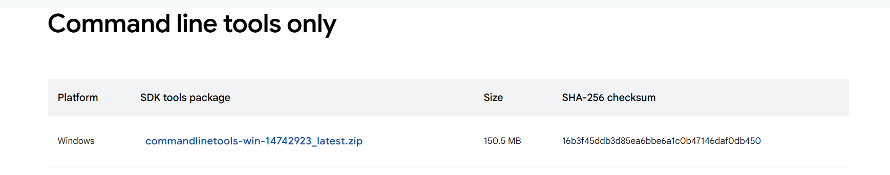

# Android Build Tools

These are tools necessary for APK patching (apksigner, zipalign)

### Installation:
Go to [Android Studio](https://developer.android.com/studio) website, scroll down to `Command line tools only` section.

Download windows package.
  

Extract downloaded zip. It will look like this:

```
root/
    cmdline-tools/
        bin/   
                sdkmanager.bat ← download tool
        ...
```
Inside cmdline-tools, create a subfolder `latest` and move all of its contents to this subfoder.

```
root/
    cmdline-tools/
        latest/
            bin/   
                sdkmanager.bat ← download tool
```

Open your terminal in `bin/`

Run `sdkmanager.bat "build-tools;34.0.0"`

If you have newer Java version installed like 21+/26, it can give you false alarm: `Java version 17 or higher is required`

In this case run `set SKIP_JDK_VERSION_CHECK=true` before running above command

Once run, it will prompt you term of condition, accept (y).

After download finished, apksigner and zipalign will be stored in `build-tools/34.0.0/`

```
root/
    .temp/
    cmdline-tools/
        latest/
            bin/   
                sdkmanager.bat
    build-tools/
        34.0.0/
            apksigner.bat
            zipalign.exe
    licenses/
```

